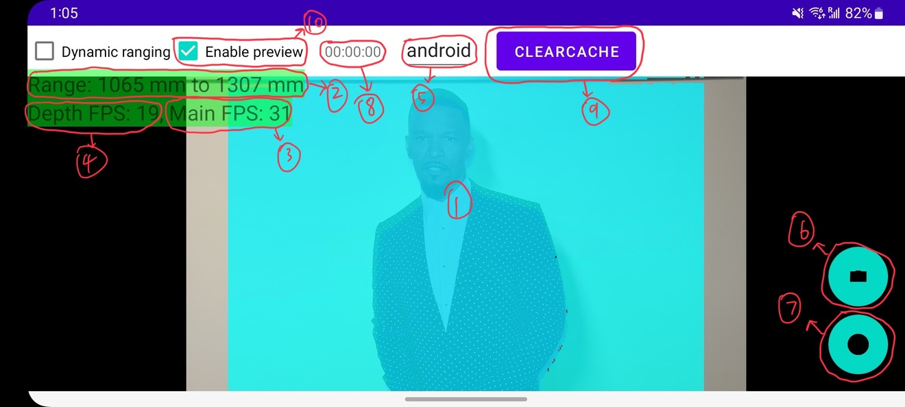

# Scoop: Mitigation of Recapture Attacks on Provenance-Based Media Authentication

:paperclip: [Scoop Paper]()  
:camera: [Scoop iOS Camera](https://github.com/trusslab/scoop_camera_ios)  
:camera: [Scoop Android Camera](https://github.com/trusslab/scoop_camera_android)  
:computer: [Scoop Viewer](https://github.com/trusslab/scoop)  
:floppy_disk: [Scoop Dataset](https://doi.org/10.5281/zenodo.15611905)

## Overview

This is a part of the Scoop project, which provides an Android application that can capture photos and videos with depth data using the Time-of-Flight (ToF) camera. 
This is modified on top of an open-source project from GitHub, which is a camera app that displays the depth data captured by the ToF camera: https://github.com/Nufflee/tof-camera. 

By default, the app captures photos and videos in JPEG and H.264(MP4 without audio) formats, respectively.
RGB resolution for both photos and videos is set to 3840x2160 (4K) and depth resolution is set to 310x205. 
For videos, the app captures at 30 frames per second (FPS) and for photos, it captures a single frame.
For videos, the depth data capture process is synchronized with the RGB capture process, ensuring that the depth data corresponds to the captured media.
The depth data is captured in a custom format with the `.adep` extension, which is designed to be used with the Scoop viewer. 

## Requirements
A Samsung Galaxy S20 series (base/plus/ultra) device with a Time-of-Flight (ToF) camera is required to run this app.

The app is not guaranteed to work on other devices, even if they have a ToF camera, due to differences in hardware and software implementations. 
Even if the app runs on other devices, it may not capture depth data correctly or at all, as we have only calibrated the depth sensor on the Galaxy S20 series. 
Please also note that our calibration process is not perfect and may not work well due to our lack of access and information about the ToF camera hardware. 
Such calibration is necessary to ensure that the depth data captured by the ToF camera is accurate and can be used in combination with the RGB data captured by the main camera.
For better results, you can check out our iOS based Scoop camera app, as iOS devices come with pre-calibrated depth sensors. 
On the other hand, you may also try to calibrate the depth sensor on your device by following various calibration techniques available online.

## Usage

1. Open the project in Android Studio.
2. Connect your Samsung Galaxy S20 series device (or other potentially compatible devices) to your computer.
3. Enable USB debugging on your device.
4. Build and run the app on your device from Android Studio.
5. Grant the necessary permissions when prompted (camera, storage, etc.). Please note that there is a chance that you need to restart the app after granting the permissions.
6. Use the app to capture photos and videos with depth data. 
7. The captured media and its depth data will be saved to the App's internal storage.
8. You can use Android Studio to download the captured media and depth data from the device to your computer for further analysis or viewing using the Scoop viewer.

## App's Interface

Screenshot of the App's interface is shown below:

1. Preview of the main camera with depth data overlay.
2. Current detected depth range.
3. Main camera frame rate.
4. Depth sensor/camera frame rate.
5. Captured media file name. (Note that for photos, the final file name will be FILE_NAME_photo.jpg, and for videos, it will be FILE_NAME_video.mp4)
6. Photo capture button.  Note that there is a 4 seconds delay after pressing the button to capture a photo.
   This is to ensure that the photographer has enough time to set up the camera and frame the shot before the photo is captured.
   After the photo is captured, the app will display a preview of the captured photo. 
   By clicking on the preview, the app will resume the live camera preview.
7. Video capture button.
8. Recording timer.
9. Clear/delete existing captured media button. (Note that this can also be used to check what media files are currently stored in the app's internal storage)

## Download Captured Media and Depth Data

1. Connect your device to your computer.
2. Open Android Studio and go to the "Device File Explorer" tab.
3. Navigate to the app's internal storage directory, which is usually located at `/data/data/com.example.tofcamera/files/`. 
4. The media files will be named according to the format specified in the app (e.g., `FILE_NAME_photo.jpg` for photos and `FILE_NAME_video.mp4` for videos).
5. The depth data files will be in the same directory with similar names (i.e., `FILE_NAME_photo_depth.adep` for photos and `FILE_NAME_video_depth.adep` for videos) as the media files but with a `.adep` extension.

## License
This project is licensed under the MIT License. See the [LICENSE](./LICENSE) file for details.
